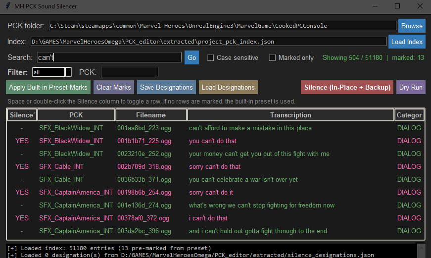

# MH PCK SoundSilencer
Marvel Heroes Omega PCK sound silencer


this tool enables silencing specific sounds such as repetitve voice lines .
the default preset targets known "i cant do that" dialog .

[`00_MH_PCK_SoundSilencer.py`](00_MH_PCK_SoundSilencer.py) is a minimal standalone tool , the only file  needed if you only want to mute those sounds , if your interested in the full PCK audio extraction and transcription , launch the dev_workflow .



[`01_dev_install_and_launch_workflow.py`](01_dev_install_and_launch_workflow.py) Parse, extract, modify, and transcribe Wwise `.pck` audio containers from Marvel Heroes Omega.  offline speech-to-text via Vosk, and a dashboard for voice-line search . the transciption is not always accurate but can be used to search for most common voice lines .

---

## Installation 

- [Python 3.10+](https://www.python.org/downloads/)
- Run [`00_MH_PCK_SoundSilencer.py`](00_MH_PCK_SoundSilencer.py).

### Dev workflow INSTALL

Run `01_dev_install_and_launch_workflow.bat`. It handles:

1. Virtual environment creation in `./venv/`
2. Dependency installation from `requirements.txt`
3. GPU capability detection (TensorFlow / PyTorch)
4. Audio classification model setup
5. Launching the tkinter workflow GUI

 External Tools for Dev Workflow

| Tool |  |
|------|---------|
| `ww2ogg.exe` | WEM -> OGG conversion |
| `revorb.exe` | Fix Ogg page granule positions |
| `ffmpeg.exe` | Audio format conversion |

---

## The Workflows

### Sound Silencer (Quick)

For muting specific voice lines  

```
00_MH_PCK_SoundSilencer.py
```

- Scans a folder of `.pck` files
- Shows a searchable table of all known audio entries
- Applies a built-in preset targeting known repetitive voice lines
- Backs up originals, then silences selected WEMs in-place
- Zero-fill strategy preserves file size for game compatibility

**Requirements:** None ( Python + tkinter, no external dependencies).

---

### Dev Workflow (Full Pipeline)

Only needed for full extraction, transcription, and audio search 
### Dev Workflow Features

| Feature | Description |
|---------|-------------|
| **Parse** | Full field-by-field parsing with hex dumps (`inspect`) |
| **Extract** | Dump all WEM streams to `.wem`, optionally convert to `.ogg` |
| **Convert** | WEM -> OGG via bundled `ww2ogg.exe` + `revorb.exe` |
| **Transcribe** | Offline speech-to-text on `.ogg` files using local Vosk model |
| **Playlist** | Concatenate all `.ogg` from a `.pck` into one review `.wav` |
| **Index** | Aggregate transcriptions from all `.pck` files into a master index |
| **Dashboard** | tkinter GUI for searching transcriptions and playing audio |
| **Modify** | Silence or replace individual WEMs with size-safe strategies |
| **Verify** | SHA-256 round-trip verification between original and modified `.pck` |
| **Repackage** | Write modified `.pck` preserving structure for game compatibility |

```
01_dev_install_and_launch_workflow.py
```

- **Source dir** - Point at the game's `CookedPCConsole/` folder
- **Tool paths** - Browse for external tools (auto-populated from bundled defaults)
- **Resume Pipeline** - Run the full extract -> classify -> transcribe -> index pipeline
- **Extract Only** - Extract and convert to OGG without transcription
- **Rebuild Index** - Rebuild `project_pck_index.json` from existing transcription data
- **EDITOR** - Open the transcription dashboard for searching and playback

**Pipeline stages:**
1. **Extract** - Parse `.pck` -> dump WEMs -> convert to OGG -> write `mapping.json`
2. **Classify** - YAMNet audio classification (dialogue vs SFX)
3. **Transcribe** - Vosk speech-to-text on dialogue files
4. **Index** - Merge all `transcription.json` into `project_pck_index.json`

**Transcribed Dashboard :**
- Full-text search across filenames and transcriptions
- Case-sensitive toggle
- Filter by category (all / dialog / sfx)
- Per-PCK filter
- Double-click to play audio 
- Silence designation toggle (ON / OFF per row)
- Persistent `silence_designations.json` output

**Requirements:** 
- wwise , vosk , this will create a local virtual environment to install the  dependencies
---


## CLI Usage

All underlying commands are available via `python -m pkg_bnk_wwise_tools <command>` 

```powershell
# Parse and inspect a .pck
python -m pkg_bnk_wwise_tools inspect input/SFX_ScarletWitch_INT.pck

# Extract with OGG conversion
python -m pkg_bnk_wwise_tools extract input/SFX_ScarletWitch_INT.pck -o ./out --to-ogg

# Full batch pipeline for a single .pck
python -m pkg_bnk_wwise_tools batch input/SFX_ScarletWitch_INT.pck -o extracted --model ./vosk-model-en-us-0.42-gigaspeech

# Process all .pck files in a directory (resumable)
python -m pkg_bnk_wwise_tools process_all input/ -o extracted --model ./vosk-model-en-us-0.42-gigaspeech

# Launch dashboard manually
python -m pkg_bnk_wwise_tools dashboard extracted/project_pck_index.json

# Run full test suite
python -m pkg_bnk_wwise_tools test input/SFX_ScarletWitch_INT.pck --to-ogg -v
```

See [`pkg_bnk_wwise_tools/CLI_main.py`](pkg_bnk_wwise_tools/CLI_main.py) or run with `--help` for full command reference.

---

## PCK Format Details

Marvel Heroes `.pck` containers hold audio in two regions: an embedded BNK (with DIDX / DATA sections) followed by loose RIFF/WAVE files with no directory. The toolkit parses both.

### Marvel Heroes .pck Format

The `.pck` files use a **hybrid structure** :

```
Offset    Content
------    -------
0x000     AKPK header (332 bytes)
          - Magic: "AKPK"
          - Length field: 0x14C (332)
          - Version: 1
          - Language descriptor: "sfx" (UTF-16LE)

0x154     BKHD (Bank Header) section
          - Version: 0x76 (118)
          - Bank ID: 0x93A04E26

0x17C     DIDX (Data Index) section
          - Entries: N WEM descriptors (wem_id, offset, length)

0x19C     DATA section
          - WEM[0] @ offset  (N bytes)
          - WEM[1] @ offset  (N bytes)

<end_of_DATA>     Loose WEM #N (RIFF/WAVE headers, no TOC)
```

After the BNK envelope ends, the remaining bytes are loose RIFF/WAVE files with no directory. The parser scans for `RIFF` magic (`52494646`) to discover them.

### Size-Safe Modification Rules

- **BNK-embedded WEMs** (inside BNK): size changes allowed; the BNK is rebuilt and offsets recalculated.
- **Loose WEMs** (after BNK): must stay the same size or the `.pck` envelope is corrupted. Use zero-fill silence instead of truncation.

### Audio Pipeline

`parse -> WEM[] -> ww2ogg.exe -> .ogg -> ffmpeg -> WAV -> Vosk -> text`, with `mapping.json` written at extraction and `transcription.json` at the end.

---

## Project Structure

```
PCK_editor/
├-- 00_MH_PCK_SoundSilencer.py      # Standalone sound silencer (minimal, no deps)
├-- 00_MH_PCK_SoundSilencer.bat     # Launcher for the silencer
├-- 01_dev_install_and_launch_workflow.py  # Full dev workflow installer + GUI launcher
├-- 01_dev_install_and_launch_workflow.bat # Launcher for the dev workflow
├-- pkg_bnk_wwise_tools/            # Main Python package (16 modules)
│   ├-- __main__.py                 # Entry point: python -m pkg_bnk_wwise_tools
│   ├-- CLI_main.py                 # Unified CLI (all subcommands)
│   ├-- CONFIG_tools.py             # External tool path configuration
│   ├-- PARSE_pck_bnk.py            # .pck -> BNK -> DIDX -> WEM parser
│   ├-- CONVERT_wem.py              # WEM -> OGG via ww2ogg + revorb
│   ├-- TRANSCRIBE_dialogue.py      # OGG -> WAV -> Vosk transcription
│   ├-- TRANSCRIBE_sfx_classifier.py # YAMNet / PANNs audio classification
│   ├-- DATA_project_pck_index.py   # Aggregate transcription.json across .pck files
│   ├-- DATA_silence_manager.py     # JSON persistence for silence designations
│   ├-- UI_transcription_dashboard.py # tkinter GUI for search + playback
│   ├-- MODIFY_repackager.py        # Replace/silence WEMs and write .pck
│   ├-- MODIFY_batch_silencer.py    # Batch silence designated WEMs in-place
│   ├-- PCK_extract_named.py        # HIRC/STID named audio extraction
│   ├-- PROCESS_batch_pipeline.py   # Incremental resumable batch pipeline
│   ├-- UTIL_logger.py              # Coloured step-by-step terminal logging
│   └-- __init__.py                 # Package init with module index
├-- extracted/                      # Per-.pck output folders (created by batch)
│   ├-- SFX_ScarletWitch_INT/
│   │   ├-- *.wem                   # Raw WEM streams
│   │   ├-- *.ogg                   # Converted OGG files
│   │   ├-- mapping.json            # index -> wem_id/ogg filename map
│   │   ├-- transcription.json      # Vosk speech-to-text results
│   │   └-- review_playlist.wav     # Concatenated review track
│   └-- SFX_AntMan_INT/
│       └-- ...
├-- vosk-model-en-us-0.42-gigaspeech/  # Local Vosk speech model (download separately)
```
---

## File References

| File | Purpose |
|------|---------|
| [`00_MH_PCK_SoundSilencer.py`](00_MH_PCK_SoundSilencer.py) | Standalone sound silencer GUI (no external deps) |
| [`01_dev_install_and_launch_workflow.py`](01_dev_install_and_launch_workflow.py) | Installer, launcher, and workflow GUI |
| [`pkg_bnk_wwise_tools/CLI_main.py`](pkg_bnk_wwise_tools/CLI_main.py) | Unified CLI entry point for all commands |
| [`pkg_bnk_wwise_tools/PARSE_pck_bnk.py`](pkg_bnk_wwise_tools/PARSE_pck_bnk.py) | `.pck` parser: AKPK header, BKHD, DIDX, DATA, loose WEM scanner |
| [`pkg_bnk_wwise_tools/CONVERT_wem.py`](pkg_bnk_wwise_tools/CONVERT_wem.py) | WEM -> OGG pipeline using ww2ogg + revorb |
| [`pkg_bnk_wwise_tools/TRANSCRIBE_dialogue.py`](pkg_bnk_wwise_tools/TRANSCRIBE_dialogue.py) | OGG -> WAV (ffmpeg) -> Vosk transcription |
| [`pkg_bnk_wwise_tools/TRANSCRIBE_sfx_classifier.py`](pkg_bnk_wwise_tools/TRANSCRIBE_sfx_classifier.py) | YAMNet / PANNs audio classification |
| [`pkg_bnk_wwise_tools/PROCESS_batch_pipeline.py`](pkg_bnk_wwise_tools/PROCESS_batch_pipeline.py) | Incremental resumable batch pipeline (extract / classify / transcribe / index) |
| [`pkg_bnk_wwise_tools/DATA_project_pck_index.py`](pkg_bnk_wwise_tools/DATA_project_pck_index.py) | Aggregate `transcription.json` files across `.pck` files |
| [`pkg_bnk_wwise_tools/DATA_silence_manager.py`](pkg_bnk_wwise_tools/DATA_silence_manager.py) | JSON persistence for silence designations |
| [`pkg_bnk_wwise_tools/UI_transcription_dashboard.py`](pkg_bnk_wwise_tools/UI_transcription_dashboard.py) | tkinter GUI: search, filter, play audio |
| [`pkg_bnk_wwise_tools/MODIFY_repackager.py`](pkg_bnk_wwise_tools/MODIFY_repackager.py) | Replace/silence WEMs and rebuild `.pck` |
| [`pkg_bnk_wwise_tools/MODIFY_batch_silencer.py`](pkg_bnk_wwise_tools/MODIFY_batch_silencer.py) | Batch silence designated WEMs in-place |
| [`pkg_bnk_wwise_tools/PCK_extract_named.py`](pkg_bnk_wwise_tools/PCK_extract_named.py) | HIRC/STID named audio extraction |
| [`pkg_bnk_wwise_tools/UTIL_logger.py`](pkg_bnk_wwise_tools/UTIL_logger.py) | Coloured step-by-step terminal logging |
| [`pkg_bnk_wwise_tools/CONFIG_tools.py`](pkg_bnk_wwise_tools/CONFIG_tools.py) | External tool path configuration |

---

## License 
- free to all , [creative commons zero CC0 1.0](https://creativecommons.org/publicdomain/zero/1.0/) , free to re-distribute , attribution not required